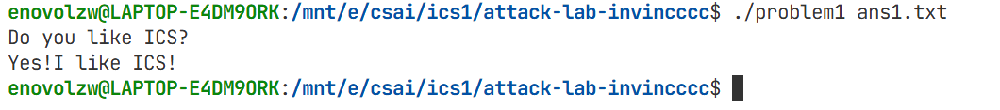
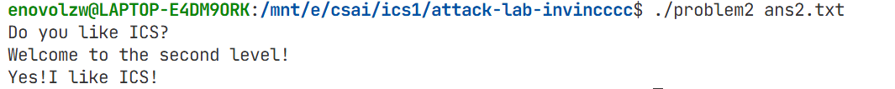
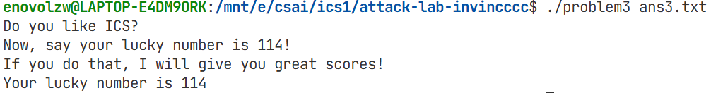
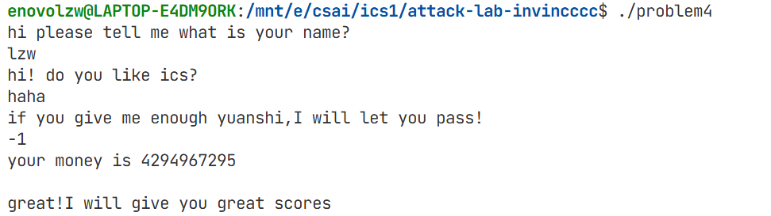

# 栈溢出攻击实验

## 题目解决思路


### Problem 1: 
- **分析**：
通过对 problem1 程序进行反汇编，可以发现程序中存在一个明显的栈溢出漏洞，func函数在栈上开辟了 0x20（32）字节的空间，实际用于存储用户输入的缓冲区地址为 -0x8(%rbp)，即缓冲区大小仅为 8 字节，并且使用了 strcpy 函数将用户输入复制到该缓冲区中，而 strcpy 不会对输入长度进行检查，因此，当输入长度超过 8 字节时，就会发生栈溢出，覆盖相邻的栈数据。
func 函数的栈帧结构如下所示（由低地址到高地址）：
```
buf[8 bytes]
saved rbp (8 bytes)
return address (8 bytes)
```
构造一个长度超过 16 字节的输入，就可以精确覆盖函数的返回地址，从而控制程序的执行流程。在程序的 .text 段中，可以发现一个名为 func1 的函数正好满足 Problem 1 的输出要求，因此本题的攻击目标就是通过栈溢出，将 func 的返回地址修改为 func1 的入口地址（0x401216）

- **解决方案**：
```python
payload = b"A" * 16 + b"\x16\x12\x40\x00\x00\x00\x00\x00"

with open("ans1.txt", "wb") as f:
    f.write(payload)
```

- **结果**：


### Problem 2:
- **分析**：
通过对 Problem 2 程序进行反汇编分析，可以发现程序中同样存在栈溢出漏洞。在 func 函数中，程序在栈上开辟了 0x20（32）字节的空间，其中实际用于存储用户输入数据的缓冲区位于 -0x8(%rbp)，即缓冲区大小仅为 8 字节。然而，该函数使用了不安全的内存拷贝函数 memcpy，将用户输入复制到该缓冲区中，并且拷贝长度被固定为 56 字节，远大于缓冲区实际大小。这将导致当用户提供的输入长度足够时，发生栈溢出，从而覆盖相邻的栈数据。
func 函数的栈帧结构如下所示（由低地址到高地址）：
```
buf[8 bytes]
saved rbp (8 bytes)
return address (8 bytes)
```
因此，只需构造一个长度超过 16 字节 的输入数据，即可覆盖 func 函数的返回地址，实现对程序执行流程的控制。与 Problem 1 不同的是，Problem 2 中用于输出正确结果的函数 func2 并非无条件执行成功分支。func2 在执行过程中会对其参数进行检查，仅当参数值正确时，才会输出 "Yes!I like ICS!"。

进一步分析 func2 的汇编代码可以发现，func2 中用于输出正确结果的代码位于一个独立的分支中，只要能够直接跳转到该成功分支的起始地址，即可绕过参数检查，直接输出正确结果。

因此，本题的攻击思路为：利用 func 函数中的栈溢出漏洞，覆盖其返回地址，使程序在 func 返回时直接跳转到 func2 内部用于输出 "Yes!I like ICS!" 的成功分支代码位置，从而绕过参数检查并完成攻击。
- **解决方案**：
```python
padding = b"\x00" * 16
success_branch = b"\x4c\x12\x40\x00\x00\x00\x00\x00"  # func2 成功分支地址

payload = padding + success_branch

with open("ans2.txt", "wb") as f:
    f.write(payload)
```
- **结果**：


### Problem 3: 
- **分析**
通过对 Problem 3 程序进行反汇编分析，可以发现程序中同样存在栈溢出漏洞。在 func 函数中，程序在栈上开辟了 0x30（48）字节的空间，其中包含一个大小为 32 字节 的局部缓冲区 buffer，用于存储用户输入的数据。然而，该函数使用了不安全的内存拷贝函数 memcpy，并且拷贝长度被固定为 64 字节，明显超过了缓冲区的实际大小，从而导致栈溢出漏洞的产生。
func 函数的栈帧结构如下所示（由低地址到高地址）：
```
buffer[32 bytes]
saved rbp (8 bytes)
return address (8 bytes)
```
与前两题不同的是，Problem 3 中用于输出正确结果的函数 func1 并不能被直接安全地调用。虽然 func1 接收一个整数参数，并在参数值为 114 时输出正确结果，但该函数内部定义了局部缓冲区，并通过 rbp 相对寻址的方式对其进行访问。由于栈随机化的存在，在栈溢出过程中无法可靠地构造一个正确的 saved rbp，因此若直接通过修改返回地址跳转到 func1，会在函数执行过程中由于非法的栈访问而导致程序崩溃。

值得注意的是，在 func 中存在一处特殊逻辑：当前的 rsp 被保存为全局变量 saved_rsp。同时，程序中还提供了一个名为 jmp_xs 的函数，该函数会跳转到 saved_rsp + 0x10 所指向的位置执行代码。而该地址恰好对应于 buffer 在栈中的起始位置。这一特性为攻击提供了关键突破口。攻击者可以在栈上的 buffer 中写入自定义的机器指令，并通过覆盖 func 的返回地址，使程序在返回时跳转至 jmp_xs，从而进一步跳转并执行栈上的注入代码。

因此，本题的攻击思路为：利用 func 函数中的栈溢出漏洞，在覆盖返回地址的同时，将一段自定义的机器码写入 buffer。该机器码负责设置好 func1 所需的参数，并以间接调用的方式跳转到 func1 执行。随后，通过将返回地址覆盖为 jmp_xs 的入口地址，使程序在函数返回时跳转至栈上的注入代码，从而成功调用 func1(114)，输出正确结果并完成攻击。
- **解决方案**：
```python
machine_ins = (
    b"\xf3\x0f\x1e\xfa"                  # endbr64（对齐/无害指令）
    b"\xbf\x72\x00\x00\x00"              # mov $0x72, %edi 参数 114
    b"\x48\xb8\x16\x12\x40\x00\x00\x00\x00\x00"  # mov $0x401216, %rax (func1 地址)
    b"\xff\xd0"                          # call *%rax
)

# buffer(32) + saved rbp(8) = 40
padding = b"\x00" * (40 - len(machine_ins))

# jmp_xs 会跳转到 saved_rsp + 0x10，也就是 buffer 起始位置
return_address = b"\x34\x13\x40\x00\x00\x00\x00\x00"  # jmp_xs 地址

payload = machine_ins + padding + return_address

with open("ans3.txt", "wb") as f:
    f.write(payload)

```
- **结果**：



### Problem 4: 
- **分析**：
 “金丝雀” 保护机制是指通过在某个函数开始执行前向栈帧中特定位置存放一个特定的数字，并且检验在函数返回前同一个位置的值有没有被改变来检测存不存在栈溢出现象，在本题的代码中具体如下
 ```
 64 48 8b 04 25 28 00 00 00    mov    %fs:0x28,%rax    # 从 fs:0x28 加载 canary
48 89 45 f8                   mov    %rax,-0x8(%rbp)   # 将 canary 存储在栈上（rbp-8）
```
在函数的开头，从 线程本地存储 (TLS) 中加载 canary 值，fs:0x28 是 x86-64 架构中存储栈保护 canary 的标准位置，在函数返回前，检查 canary 是否被修改：
```
48 8b 45 f8                   mov    -0x8(%rbp),%rax   # 从栈上读取 canary
64 48 2b 04 25 28 00 00 00    sub    %fs:0x28,%rax     # 与原始 canary 比较
74 05                         je     131a              # 如果相等，跳转到正常返回
e8 b6 fd ff ff                call   10d0 <__stack_chk_fail@plt>  # 否则，调用失败处理
```
下面分析本题的解法，本题比较直接，读懂关键部分代码即可：
```c
// 凯撒解密函数
void caesar_decrypt(char* str, int shift) {
    size_t len = strlen(str);
    
    for (size_t i = 0; i < len; i++) {
        char c = str[i];
        
        if (isalpha(c)) {
            char base = islower(c) ? 'a' : 'A';
            int offset = (c - base - shift + 26) % 26;
            str[i] = base + offset;
        }
    }
}

// 成功函数
void func1() {
    puts("Congratulations! You have entered the correct value.");
}

// 主要验证函数
void func(int arg) {
    int canary_storage; // 模拟栈保护金丝雀
    int local_var1 = -2;        // -0x10(%rbp) = 0xfffffffe (-2)
    int arg_copy1 = arg;        // -0x18(%rbp) = 参数的副本
    int arg_copy2 = arg;        // -0xc(%rbp)  = 参数的另一个副本
    
    printf("Input: %d\n", arg);
    

    if ((unsigned int)arg_copy1 >= (unsigned int)local_var1) {
        int i = 0;
        while ((unsigned int)i < (unsigned int)local_var1) {
            arg_copy1--;
            i++;
        }
        
        // 检查特定条件
        if (arg_copy1 == 1 && arg_copy2 == -1) {
            // 成功条件：输入必须是 -1
            func1();
            exit(0);
        } else {
            // 失败信息
            puts("Try again.");
        }
    } else {
        // 输入小于 -2 的情况
        puts("Value is too low.");
    }
}

int main() {
    // 栈空间分配和 canary 设置
    char buffer1[128];       // -0x80(%rbp)
    char buffer2[128];       // -0x60(%rbp) 实际大小更大
    int input_num;           // -0xa0(%rbp)
    
    // 初始化一些变量
    int var1 = -1;           // -0x9c(%rbp)
    int var2 = var1;         // -0x98(%rbp)
    int var3 = 0xf4143da0;   // -0x94(%rbp) 某种魔数
    
    // 第一个提示
    puts("Enter first string:");
    
    // 读取第一个字符串
    scanf("%s", buffer1);
    
    // 第一个加密字符串
    char encrypted_str1[] = {
        'p', 'a', 'k', 'a', 'g', 'x', 'u', 'w',
        'x', 'u', 'w', 'q', 'u', 'o', 'e', '\0'
    };
    
    // 对第一个加密字符串进行凯撒解密
    caesar_decrypt(encrypted_str1, 12);
    
    // 第二个提示
    puts("Enter second string:");
    
    // 读取第二个字符串
    scanf("%s", buffer2);
    
    // 第二个加密字符串
    char encrypted_str2[] = {
        'u', 'r', 'k', 'a', 'g', 's', 'u', 'h',
        'q', 'y', 'q', 'k', 'g', 'm', 'z', 'e',
        't', 'u', 'u', 'i', 'u', 'x', 'x', 's',
        'u', 'h', 'q', 'k', 'a', 'g', 's', 'a',
        'h', 'q', 'k', 'a', 'g', 's', 'a', 'a',
        'p', 'e', 'o', 'a', 'd', 'q', 'e', '\0'
    };
    
    // 对第二个加密字符串进行凯撒解密
    caesar_decrypt(encrypted_str2, 12);
    
    // 第三个提示
    puts("Enter an integer:");
    
    // 无限循环：读取整数并调用 func
    while (1) {
        // 读取整数
        scanf("%d", &input_num);
        func(input_num);
    }
    
    return 0; // 实际不会执行到这里
}
```
简单分析可知，程序输出通关信息的是 func1，yuanshi 为 -1，func就会调用func1。所以前面的加密解密过程均不重要，只要最后输入 -1 即可。
- **解决方案**：本题不需要payload
- **结果**：


## 思考与总结
总体来看，本次实验中四个题目的核心思想是一致的：首先定位程序中可能导致栈溢出的危险点，其次寻找能够输出目标字符串或达成目标效果的代码位置，最后通过构造合适的 payload 劫持程序控制流。不同题目之间的差异，主要体现在防护机制的引入以及可利用条件的变化，但基本的分析方法和攻击逻辑是相通的。

在实验过程中我逐渐体会到，栈溢出攻击并不一定要求从函数入口开始执行，也不要求严格遵循函数的调用约定。很多时候，只要能够跳转到已有代码片段中合适的位置，就可以绕过原有的判断逻辑，直接达成攻击目标。这种思路在 Problem 2 中尤为典型，通过直接跳转到成功分支内部，从而绕过参数检查。此外，在 Problem 3 中，当现有代码片段无法满足需求时，还可以通过在栈上手动构造机器码并结合已有跳转机制执行，进一步体现了栈溢出攻击的灵活性和多样性。

最后，一些函数如strcpy、memcpy等在使用时需要注意缓冲区溢出的问题，这个lab对我理解程序的安全性有很大帮助，以后使用这些函数需要格外谨慎。

## 参考资料

